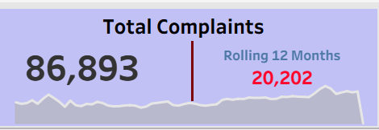
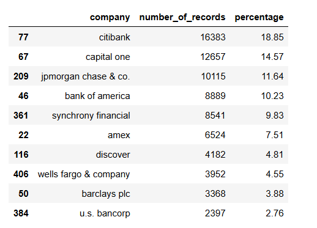
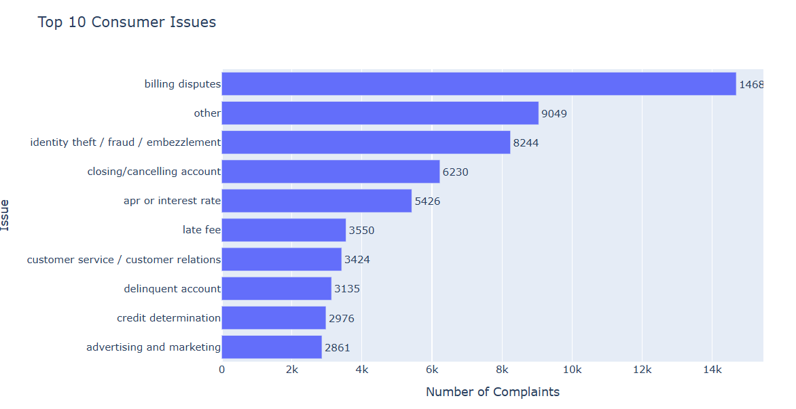
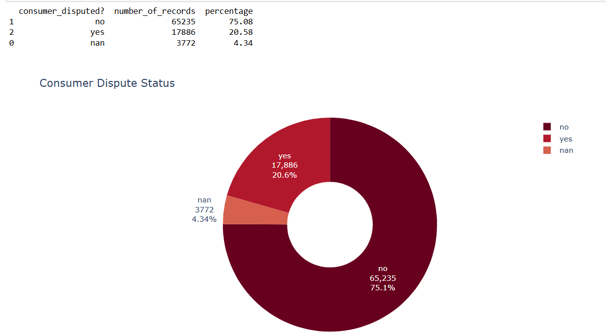
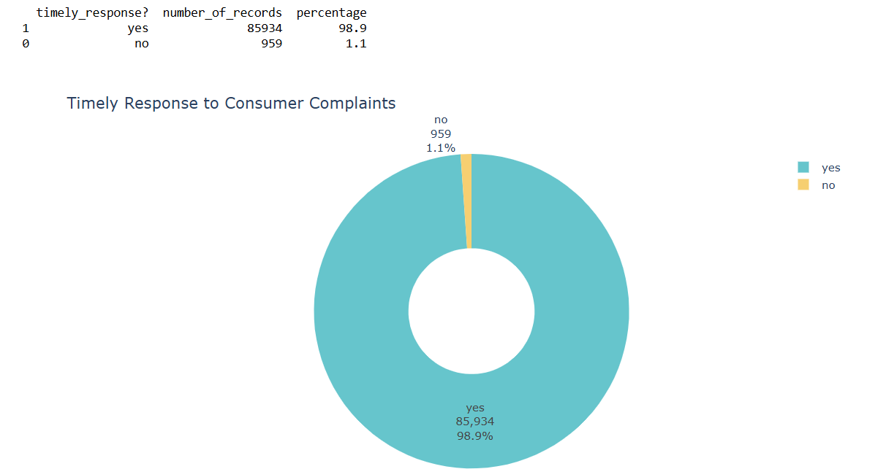
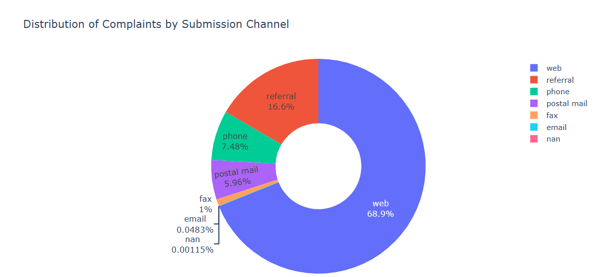
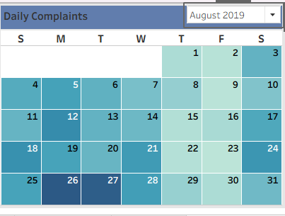
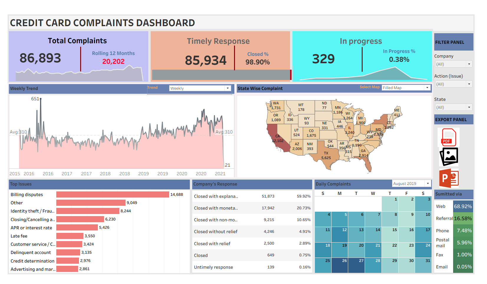

# 🏦 CFPB Consumer Complaints Analysis | Python + Tableau
Data-driven insights into consumer complaints, company responses, and dispute patterns

## 📊 Project Overview

This project analyzes consumer complaints data from the **Consumer Financial Protection Bureau (CFPB)** to uncover insights into:
- How financial companies handle consumer complaints
- Response efficiency and timeliness
- Dispute trends across different companies and products

As a **Data Analyst**, the goal was to clean, prepare, and analyze the dataset to answer key business questions and visualize insights using Python and Tableau.

## 💼 Business Problem Statement

The **CFPB** and partner companies want to understand how effectively consumer complaints are being managed and resolved.

They’ve asked for:
1. An overview of total complaints and complaint categories  
2. Identification of top issues and products with the most complaints  
3. Timeliness of company responses and average resolution time  
4. Insight into consumer disputes — how often customers are unsatisfied  
5. Complaint submission trends over time (daily, monthly, by channel)

The main question:  
> “Which companies are receiving the most complaints, how are they responding, and are customers satisfied?”

## 🧰 Tools & Technologies

- **Python (Pandas, Matplotlib, Seaborn, Plotly)** – Data cleaning, KPI computation, and visualizations  
- **Tableau** – Dashboard design and advanced data storytelling  
- **Excel** – Data inspection and initial exploration  
- **GitHub** – Version control and project documentation

## 🗂 Dataset Overview

**Source:** Consumer Financial Protection Bureau (CFPB) public dataset  
**Rows:** 2M+ complaints  
**Columns:** 23 fields including company, product, issue, state, complaint narrative, date received, and timely response flag.

**Key Columns:**
| Column | Description |
|--------|--------------|
| company | Name of the financial institution |
| complaint_id | Unique ID for each complaint |
| product | Product category (e.g., credit card, mortgage) |
| company_response_to_consumer | How company responded |
| timely_response? | Whether the company responded on time |
| consumer_disputed? | Whether consumer disputed the resolution |
| date_received | Date complaint was received |
| date_sent_to_company2 | Date complaint was sent to the company |

## 🧼 Data Cleaning Process

Steps performed in Python:
- Removed duplicate records  
- Standardized column names  
- Parsed and formatted date fields  
- Calculated response time (days between received and sent dates)  
- Created flags for “Timely Response” and “Disputed Complaint”  
- Filtered invalid or missing complaint entries

## 📈 Exploratory Data Analysis (EDA)

1. **Total Complaints Overview**  
   *Shows the total complaints received and rolling 12-month trend*  
    
   
    

3. **Top 10 Companies by Complaint Volume**  
   *Highlights which companies received the most complaints*  
   

4. **Top Complaint Issues**  
   *Displays the most common issues raised by consumers*  
   

5. **Disputed vs Non-Disputed Complaints**  
   *Shows how many consumers disputed the company’s response*  
   

6. **Timely vs Untimely Responses**  
   *Analyzes how quickly companies respond to complaints*  
   

7. **Complaints by Submission Channel**  
   *Visualizes the percentage of complaints submitted via each channel (Web, Phone, Email, etc.)*  
   

8. **Complaint Trend Over Time**  
   *Daily complaint trend line showing peaks and drops over time*  
   

## 🧾 KPIs & Definitions

| KPI | Definition | Formula | Example Use |
|------|-------------|----------|--------------|
| Total Complaints | Total number of consumer complaints recorded | Count of `complaint_id` | Overall complaint volume |
| In-Progress Complaints | Complaints still marked as “In Progress” | Count of `company_response_to_consumer = "In Progress"` | Monitor open cases |
| Timely Response Rate | % of complaints responded to on time | (`Timely="Yes"` ÷ Total Complaints) × 100 | Measure response efficiency |
| Disputed Complaints Rate | % of complaints consumers marked as “Disputed” | (`Disputed="Yes"` ÷ Total Complaints) × 100 | Measure dissatisfaction |
| Avg. Days to Respond | Average days between received and sent dates | Mean(`avg_no_of_days`) | Measure operational efficiency |
| Top Complaint Issue | Most frequent issue raised | Mode(`issue`) | Identify recurring problems |

## 💡 Key Insights

1. **High Complaint Volume:** Top 3 companies account for over 40% of total complaints.  
2. **Response Timeliness:** ~88% of complaints were responded to on time.  
3. **Disputed Rate:** About 7–10% of consumers disputed company resolutions.  
4. **Submission Channels:** Most complaints were submitted via Web, showing customer preference for online engagement.  
5. **Daily Trends:** Noticeable spikes during certain months — may align with product releases or financial events.

## 🧭 Recommendations

- Focus on **improving dispute handling** — analyze reasons for disputes in narratives.  
- Enhance **timely response tracking** through automated alerts.  
- Prioritize customer experience for **top complaint products** (like credit cards and mortgages).  
- Use complaint channel insights to **optimize support staffing** (e.g., more agents online).  

## 📊 Tableau Dashboard Preview

The Tableau dashboard includes:
- Total complaints by company and issue  
- Disputed vs Timely complaint rates  
- Submission channel and trend analysis  

## 🔗 Project Links
- **Tableau Public Dashboard:** [Add your Tableau link here]  
- **GitHub Repository:** [Your GitHub Repo Link]

---

